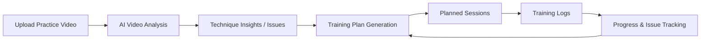
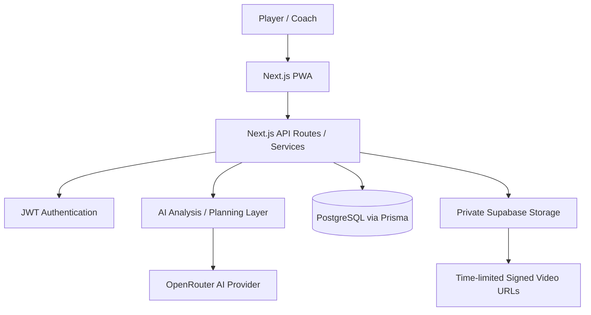

# AI Tennis Coaching Platform

A full-stack AI-assisted tennis training platform for players and coaches. It combines structured training plans, session tracking, player progression, video-based technique feedback, and coach workflows in one system.

> **Portfolio showcase.** The production repository remains private because the product is still evolving and may support future commercial use. This public repository documents the product architecture, engineering decisions, and selected implementation patterns without publishing the full source code or business-sensitive logic.

## Project at a glance

- **Product type:** Full-stack web / PWA
- **Status:** Active private product
- **Role:** Product owner, solution designer, and developer
- **Development approach:** Designed and developed by me with AI-assisted development tools, including Kiro, used to accelerate implementation, testing, and iteration
- **Primary users:** Tennis players and coaches
- **Core stack:** Next.js 15, React 19, TypeScript, PostgreSQL, Prisma, Supabase Storage, OpenRouter
- **Languages:** English and Chinese

## The problem

Amateur players often collect disconnected pieces of training information: coach feedback, notes, videos, practice metrics, and weekly goals. Most video-analysis tools also stop at one-off feedback instead of connecting the analysis to an ongoing development plan.

This platform was designed around a more complete loop:

```text
Assess → Train → Record → Analyze → Identify Issues → Plan → Repeat
```

The goal is to turn isolated practice sessions into a persistent training system.

## Core product capabilities

- Player and coach authentication with role-aware workflows
- Coach trainee management
- Weekly training plans
- Structured training logs
- Practice video upload and AI-generated technique feedback
- Progress dashboards and charts
- NTRP-style level assessment
- Skill progression, XP, missions, and achievements
- Searchable technical notes
- English / Chinese interface

## AI-enabled training workflow



The private implementation stores analysis results independently from the original video file, allowing training history and feedback to remain available even after video-retention expiry.

## Solution architecture



## Engineering highlights

### Private video storage
Practice videos are stored in a private Supabase Storage bucket and accessed using time-limited signed URLs rather than public file URLs.

### Retention-aware design
Video files have plan-based retention while the associated AI feedback and training history remain persistent.

### Role-aware domain model
The system supports both self-directed players and coaches managing multiple trainees.

### Persistent development model
The domain model includes skill progression, recurring issues, weekly missions, generated plans, AI coach summaries, guided training flows, and level assessments.

### Validation and testing
The private codebase uses Zod, Vitest, Testing Library, fast-check, and ESLint.

## Technology stack

| Area | Technology |
| --- | --- |
| Framework | Next.js 15 / App Router |
| UI | React 19, TypeScript, Tailwind CSS |
| Database | PostgreSQL |
| ORM | Prisma |
| Authentication | JWT in httpOnly cookies, bcrypt |
| Validation | Zod |
| AI integration | OpenRouter |
| Video storage | Supabase Storage |
| Charts | Chart.js |
| Testing | Vitest, Testing Library, fast-check |
| PWA | next-pwa |
| Internationalization | English / Chinese |

## Public vs private repositories

This repository is intentionally the **public product and architecture showcase**.

The private production repository contains the working implementation and continues to evolve independently. It is not mirrored here to avoid exposing commercial product logic, security-sensitive implementation details, internal prompts, and unfinished experiments.

## Selected documentation

- [Architecture](docs/architecture.md)
- [AI Video Analysis](docs/ai-video-analysis.md)
- [Product Workflow](docs/product-workflow.md)
- [Storage & Retention](docs/storage-and-retention.md)
- [Authentication & Roles](docs/auth-and-roles.md)
- [Testing & Quality](docs/testing-and-quality.md)

## Development ownership

I own the product direction, solution design, architecture decisions, implementation, integration, and iteration of the application.

AI-assisted development tools were used as part of the engineering workflow to speed up implementation and experimentation. The architectural decisions, feature scope, integrations, debugging, and product direction remain developer-led.

---

**Portfolio snapshot:** This documentation reflects the current product architecture at the time of publication. The private production system may continue to evolve.