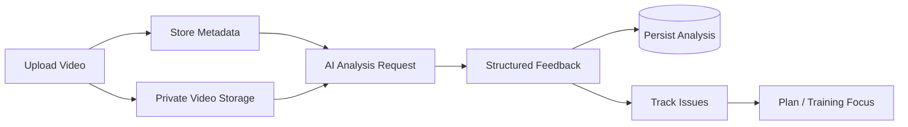

# AI Video Analysis

The video-analysis feature is designed as part of a training loop rather than as a standalone AI demo.

The production domain model records the user, optional trainee, original filename, media metadata, stroke type, user question, structured feedback, processing status, plan type at upload, and retention/deletion information.

A key decision is to separate the video file from the analysis record. When a file expires or is deleted, the feedback and training history can remain available.

The public showcase deliberately does not expose production prompts, model-selection rules, analysis orchestration code, proprietary scoring/recommendation logic, or credentials.
