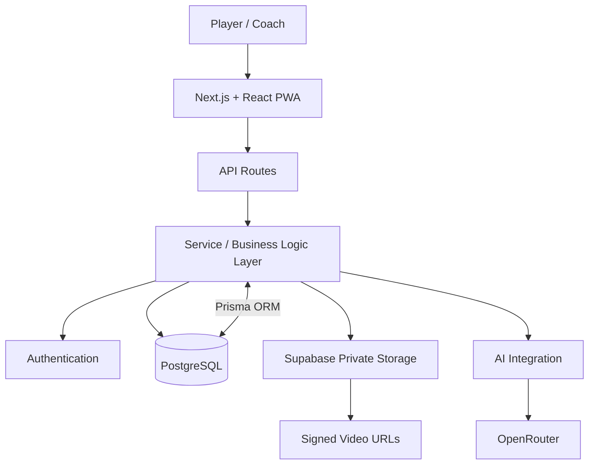

# Architecture

## Overview

The platform is implemented as a full-stack Next.js application with PostgreSQL persistence, private object storage for training videos, and external AI inference through OpenRouter.

The private production schema models users and roles, trainees, weekly plans, training logs, video analyses, technical notes, skill progress, XP and achievements, recurring issues, weekly missions, AI-generated plans and summaries, guided training flows, and NTRP-style assessments.

The architecture separates large temporary media assets from persistent training records so video files can expire without deleting long-term analysis and progress history.
