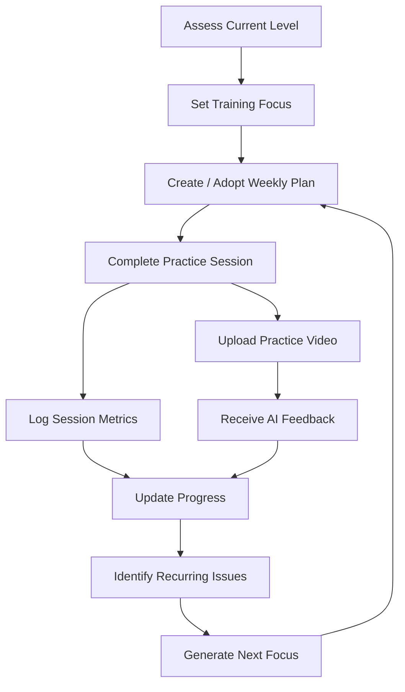

# Product Workflow

Weekly plans can be manual or AI-generated. Training logs can capture session type, duration, rally metrics, serve success, key problems, reflections, coach feedback, homework, and planned content.

The platform also models skill progress, XP history, achievements, weekly missions, recurring issues, and hybrid NTRP-style assessments that can combine questionnaire, video, and training-data signals.

Coach accounts can maintain trainee profiles and apply the same plan/log/assessment concepts across multiple players.
