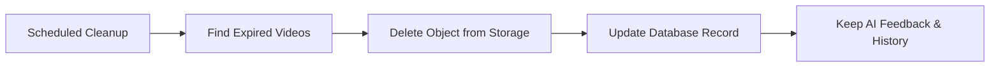

# Storage & Retention

Practice videos are stored in a private Supabase Storage bucket and accessed using time-limited signed URLs.

The current private implementation supports plan-based retention:

| Plan | Retention | Max active videos |
| --- | ---: | ---: |
| Free | 7 days | 5 |
| Pro | 90 days | 100 |
| Coach | Configurable | Configurable |

A cleanup workflow can remove expired media while preserving AI feedback and training history.

The design distinguishes temporary raw media from persistent derived knowledge. Production credentials, cleanup secrets, and infrastructure configuration are intentionally excluded from this public showcase.
